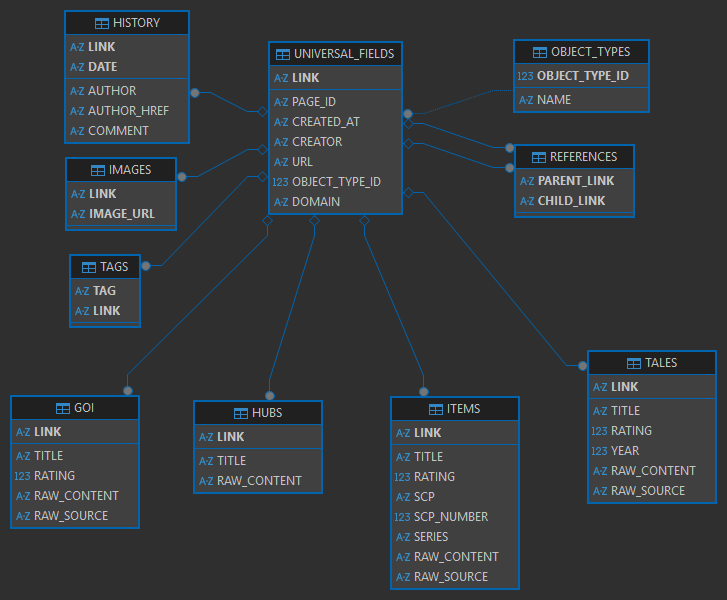

# SCP Database

A simple project that uses the handy [scp-api](https://github.com/scp-data/scp-api) to convert JSON data of SCP objects into a SQLite database.

## How to use this data

Simply download the [scp.db](./scp.db) file to access the SQLite database.

## ER Diagram

## Schedule

Runs weekly at 12:00 UTC on Sundays to update database in the repository

## Licensing

This project is not affiliated with the SCP Wiki or any of its admins.

[All content from the wiki is subject to the license of the wiki.](https://scp-wiki.wikidot.com/licensing-guide)
