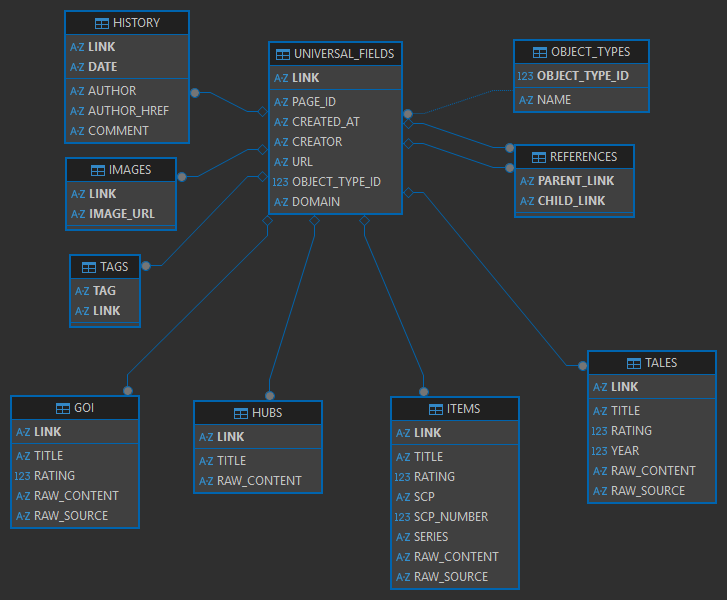

# SCP Database

A simple project that uses the handy [scp-api](https://github.com/scp-data/scp-api) to convert JSON data of SCP objects into a SQLite database.

## How to use this data

 To get the data locally, follow these steps:
 1. Clone the scp-api repository in the same directory as this project
  - `git clone https://github.com/scp-data/scp-api.git`
 2. Run the `create_db.py` script and it will generate the `scp.db` file
  - `python create_db.py`

## ER Diagram

## Schedule

Runs weekly at 12:00 UTC on Sundays to update database in the repository

### Update
Github lfs is reaching free limits for my account, so the weekly jobs are currently disabled. You will need to clone this project locally and follow steps to generate the database instead.

## Licensing

This project is not affiliated with the SCP Wiki or any of its admins.

[All content from the wiki is subject to the license of the wiki.](https://scp-wiki.wikidot.com/licensing-guide)
